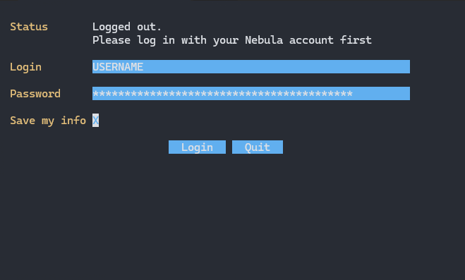

# PayShop 3 - Your Personal Black Market!

## Disclaimer
PayShop3 works via a public shop database. Although many items are marked as purchasable, it is not clear if it was intended for them to be. 

**USE AT YOUR OWN RISK**

## What is it?
PayShop3 is a console application with mouse support for buying assets for [PayDay3](https://store.steampowered.com/app/1272080/PAYDAY_3/) that works by placing orders directly on [Nebula](https://nebula.starbreeze.com/).

No longer you need to spend hours buying Zipline Bags one by one! With this app you can place an order for hundreds, thousands or even millions! (if your wallet would handle that much of course)

Aside from basic preplanning assets, you can also buy any hesit-exclusive assets and even C-Stacks!

You can place 2 types of orders: 
- **By item count.** This will add selected items to the cart, where each asset would be bought N times
- **By wallet amount.** You can set up a specific budget for the buy order and the app would automatically find the most cost-effective way of ordering it

## Features

- [x] Bulk orders for basic preplanning assets
- [x] Bulk orders for exclusive preplanning assets
- [x] Budget specific orders
- [x] Bulk orders for C-Stacks
- [x] Automatic login
- [ ] Inventory view
- [ ] Bulk orders for PayDay credits
- [ ] Arbitrary item ordering
- [ ] OAuth login option (Log-in via Steam, PSN or XBOX)

## Automatic login
If `"Save my info"` option is chosen, PayShop3 creates a file called `payshop3_logindata.json` in the directory where the program is located.

Upon startup the app also looks for this file nearby, and reads it if found.

**THIS FILE CONTAINS SENSITIVE INFORMATION ABOUT YOUR ACCOUNT! PLEASE KEEP IT SAFE!**

You can always opt not to save any login info. Logging out of your account would automatically delete the file.

## Screenshots

